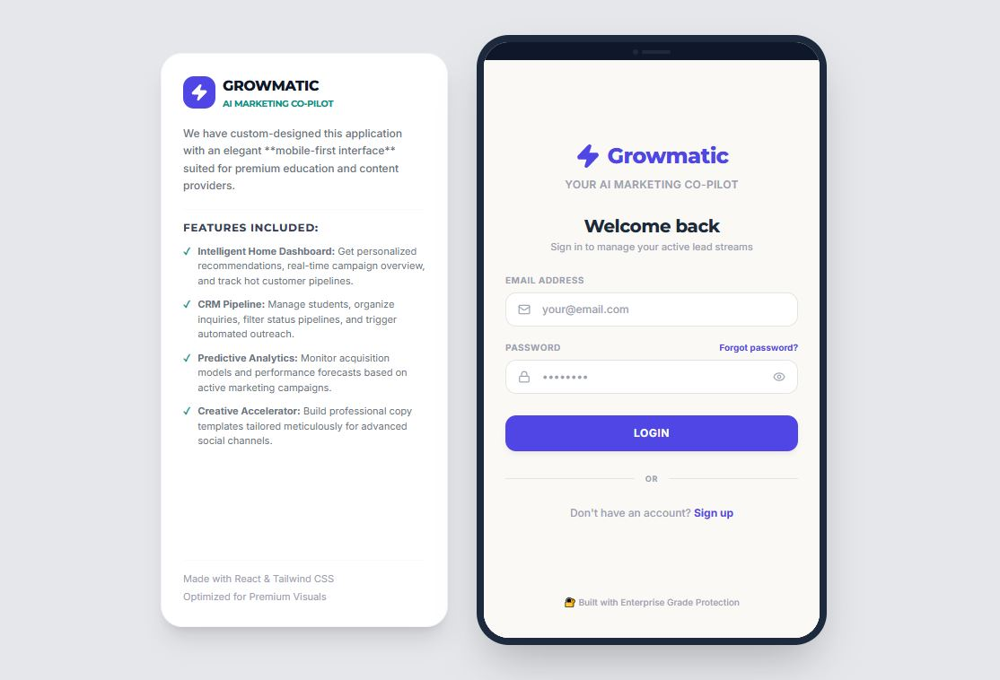

# Growmatic - AI Marketing Co-Pilot for Indian SMBs

> Stop guessing. Start growing.

Growmatic is an AI-powered marketing co-pilot built specifically for Indian small businesses. It combines AI-driven lead qualification, intelligent campaign recommendations, plain language ROI insights and creative performance intelligence — all in one mobile-first platform.

Built as a 10-day project by a team of 6.

---

## Live Demo

| | Link |
|--|--|
| Live App | [growmatic.vercel.app](https://growmatic-ai-marketing-copilot.vercel.app/) |
| Demo Video | [YouTube Walkthrough](https://youtu.be/1fo62z1EDCc) |
| Telegram Bot | [@growmatic_idals_bot](https://web.telegram.org/k/#@growmatic_bot) |



### Demo Credentials
```
Email: demo@growmatic.in
Password: Growmatic@2026
```

---

## The Problem

Indian SMBs spend thousands on digital marketing every month but:

- **90%** cannot tell which campaign generated genuine leads
- **Fake leads** waste hours of sales time every week
- **Existing tools** — HubSpot, Zoho, JustDial — are built for agencies not small business owners
- **No tool** connects Meta ads to WhatsApp or Telegram natively end to end

We interviewed **8 business owners** across Mumbai, Chennai, Jodhpur and Bengaluru to validate these pain points before writing a single line of code.

---

## The Solution

Growmatic solves 5 core pain points:

| Pain Point | Feature |
|-----------|---------|
| Fake leads with no intent | AI Lead Intent Scoring via Telegram bot |
| No guidance on what to do next | Daily AI Recommendation Engine |
| No native ad to messaging pipeline | Telegram Native Lead Pipeline |
| Cannot measure ROI in plain language | Plain Language ROI Dashboard |
| No clarity on which creative works | Creative Performance Intelligence |

---

## Tech Stack

| Layer | Technology |
|-------|-----------|
| Frontend | React 18 + Vite + TypeScript + Tailwind CSS |
| Database | Supabase - PostgreSQL + Auth + RLS |
| AI Layer | Claude API by Anthropic - claude-haiku-4-5 |
| Messaging | Telegram Bot API |
| Bot Hosting | Railway |
| Frontend Hosting | Vercel |
| Version Control | GitHub |

---

## Features

### 1. AI Lead Intent Scoring - CP1
- Telegram bot qualifies every lead through a 5 question conversation
- Claude API scores each lead as High, Medium or Low intent
- Low intent leads archived automatically — owner not disturbed
- Full conversation transcript saved to Supabase

### 2. AI Next Step Recommendations - CP3
- One personalized recommendation every time the owner opens the app
- Generated by Claude API based on real campaign and lead data
- Do it for me button executes the recommendation instantly
- Context-aware — different recommendation for beginner vs advanced user

### 3. Telegram Native Lead Pipeline - CP4
- Lead clicks Telegram CTA in Meta ad
- Bot qualifies them through name, dance style, batch, city, phone
- Lead scored and saved to Supabase automatically
- Appears in Growmatic Lead Inbox in real time

### 4. Plain Language ROI Dashboard - CP5
- Four core metrics — Total Spent, Total Leads, Conversions, ROAS
- AI summary explains what the numbers mean in simple English
- Campaign comparison shows which campaign performed best
- State-wise lead quality breakdown

### 5. Creative Performance Intelligence - CP7
- Path 1 — AI generates 3 creative variants with performance predictions
- Path 2 — Upload your own poster — Claude vision API analyses it
- Creative library stores all creatives with performance history
- Top performers identified automatically — one tap reuse

---

## Project Structure

```
growmatic/
├── src/
│   ├── components/
│   │   ├── HomeTab.tsx
│   │   ├── LeadsTab.tsx
│   │   ├── RoiTab.tsx
│   │   ├── CreativeTab.tsx
│   │   ├── LoginScreen.tsx
│   │   ├── SignupScreen.tsx
│   │   ├── OnboardingScreen.tsx
│   │   ├── LeadDetailScreen.tsx
│   │   └── CreateCampaignScreen.tsx
│   ├── supabase.ts
│   ├── AuthContext.tsx
│   ├── types.ts
│   ├── App.tsx
│   ├── main.tsx
│   └── vite-env.d.ts
├── public/
│   └── posters/
│       ├── poster1.jpg
│       └── poster2.jpg
├── bot-server.mjs
├── run-bot.mjs
├── package.json
└── vite.config.ts
```

---

## Database Schema

Six tables with Row Level Security enabled:

| Table | Purpose |
|-------|---------|
| users | Business owner profiles and onboarding data |
| leads | All leads with intent scores and Telegram transcripts |
| campaigns | Campaign details and Meta campaign IDs |
| creatives | Creative assets with performance metadata |
| recommendations | AI generated recommendations and outcomes |
| campaign_metrics | Daily campaign performance data |

---

## Local Setup

### Prerequisites
- Node.js 18 or above
- npm
- Supabase account
- Anthropic API key
- Telegram Bot token

### Step 1 - Clone the repository
```bash
git clone https://github.com/your-username/growmatic.git
cd growmatic
```

### Step 2 - Install dependencies
```bash
npm install
```

### Step 3 - Create .env file
```bash
# Frontend - Vite
VITE_SUPABASE_URL=your_supabase_url
VITE_SUPABASE_ANON_KEY=your_supabase_anon_key
VITE_CLAUDE_API_KEY=your_claude_api_key
VITE_TELEGRAM_BOT_TOKEN=your_telegram_bot_token

# Bot - Node.js
SUPABASE_URL=your_supabase_url
SUPABASE_ANON_KEY=your_supabase_anon_key
SUPABASE_SERVICE_KEY=your_supabase_service_role_key
ANTHROPIC_API_KEY=your_claude_api_key
TELEGRAM_BOT_TOKEN=your_telegram_bot_token
```

### Step 4 - Set up Supabase database
Run the SQL from the setup script in your Supabase SQL Editor:
```sql
-- Enable UUID generation
create extension if not exists "uuid-ossp";

-- Create all 6 tables with RLS
-- See /docs/schema.sql for complete SQL
```

### Step 5 - Start the React app
```bash
npm run dev
```
App runs at http://localhost:3000

### Step 6 - Start the Telegram bot (separate terminal)
```bash
npm run bot
```

---

## Deployment

### Frontend - Vercel
1. Connect GitHub repository to Vercel
2. Add all VITE_ environment variables in Vercel dashboard
3. Build command - `npm run build`
4. Output directory - `dist`
5. Framework preset - Vite

### Bot - Railway
1. Connect GitHub repository to Railway
2. Add bot environment variables — TELEGRAM_BOT_TOKEN, SUPABASE_URL, SUPABASE_SERVICE_KEY, ANTHROPIC_API_KEY
3. Start command - `node bot-server.mjs`
4. Build command - `npm install @supabase/supabase-js dotenv`

---

## User Personas

| Persona | Business | Experience Level | Primary Pain Point |
|---------|---------|-----------------|-------------------|
| Rajan | Chettinad Royal - Chennai | Beginner | Tried JustDial - failed - went back to word of mouth |
| Arjun | Duskin - Bengaluru | Intermediate | Good Instagram but no conversion intelligence |
| Shijin | IDALS - Mumbai | Advanced | 6 years Meta Ads - CPL doubled - quality leads problem |

---

## Key Metrics

| Metric | Target |
|--------|--------|
| North Star | SMBs receiving qualified lead within 7 days of signup |
| Activation | 60% complete campaign creation within 48 hours |
| Retention | 40% weekly active users return following week |
| ROAS | Above 3x average across all campaigns |

---

## Roadmap

### Phase 1 - V1 Production (June to August 2026)
- [ ] WhatsApp Business API - replace Telegram
- [ ] Meta Marketing API - real campaign launch and data pull
- [ ] Claude API backend migration - Supabase Edge Functions
- [ ] Regional language support - Hindi, Tamil, Telugu
- [ ] Google Business Profile management

### Phase 2 - V2 Scale (September to December 2026)
- [ ] ML-based lead scoring
- [ ] Automated campaign optimization
- [ ] Marketing automation - WhatsApp nurture sequences
- [ ] Google Ads integration
- [ ] Agency dashboard

---

## Known V1 Limitations

| Limitation | Production Plan |
|-----------|----------------|
| Telegram instead of WhatsApp | WhatsApp Business API via BSP in V1 |
| Static ROI demo data | Meta Marketing API in V1 |
| Claude API called from browser | Supabase Edge Functions in V1 |
| All Telegram leads go to demo account | Per-business bot token routing in V1 |
| No real campaign launch | Meta Marketing API in V1 |

---

## Team

Built by a team of 6 during a 10-day sprint.

[Shijin Ramesh](https://www.linkedin.com/in/shijinramesh/), [Ankita Chatterjee](https://www.linkedin.com/in/ankita-chatterjee-81811a147/), [Adamya Varshney](https://www.linkedin.com/in/adamya-varshney15/), [Navneet Sharma](https://www.linkedin.com/in/navneet-sharma-aaa1b523a/), [Maheswara Manikanta](https://www.linkedin.com/in/maheswara-manikanta-pullela-179430281/), [Akshat Pareek](https://www.linkedin.com/in/akshatpareek29/)

---

## License

MIT License - feel free to use this as inspiration for your own product.

---

## Acknowledgements

- **Anthropic** - Claude API for AI lead scoring and recommendations
- **Supabase** - Backend infrastructure
- **Vercel** - Frontend hosting
- **Railway** - Bot hosting
- **Telegram** - Messaging platform for demo

---

*Built in 10 days. Deployed in production. Ready to help Indian SMBs grow.*
